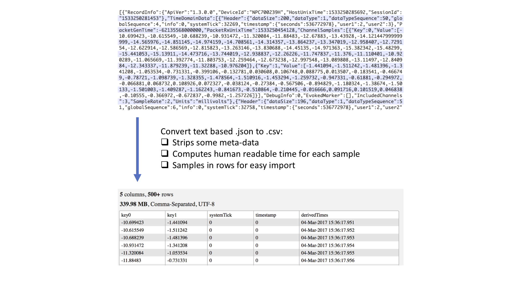

Unravel RC+S Time Domain Data
==========================

General summary: 
-------------

RC+S streams data in packet form, such that if you have gaps between packets, this can adversely affect the computation of PSD's or other event related measures.   
  
For applications in which data analysis required getting the time domain data into matrix form this code is useful. It also helps in debugging large recordings by separating the data from the meta data. It does so in the expense of space such that the derives files take up more disk space. Below is a visual summary of what raw saved data looks like (in .json form) vs. the derived data from our code. 

Streaming modes in RC+S: 
-------------
A variety of factors influence the degree of packet loss one can expect with RC+S. These include packet size, the streaming mode (3/4 - 4 is better for streaming), ratio (the ratio of packets sent from INS to CTM vs commands sent from CTM to INS) and the number of data channels being acquired. During our benchmark testing we used mode 4, ratio 32, 50msec packets and streamed 2 time domain channels as well as IMU data. In this setting we achieve packet loss comprising around ~1% of the data in a 2 hour continuous recording under ideal bench-top conditions. 

What this code does: 
-------------

This codebase parses RC+S time domain data into human readable CSV's such that all samples collected at the same time are on the same row. This package explicitly unpacks the RC+S `RawDataTD.json` output file into a .csv with samples along rows and channels in columns. This makes data analysis much easier. Though the .csv file can take up 2x more space than .json file, it can be useful for quick data analysis or for easy data sharing. You can also skip saving the actual file (which takes majority of code runtime to just use the derived table). You can see examples of the .json output of RC+S and the output of the same data in "unraveled" form in the `sample_data` folder.   

Schematic example to understand packet structure: 
-------------
  
This code also serves a resource to help understand some of the headers associated with each packet in the RC+S data. 
  
Below is a schematic example we will work with to understand packet structure in RC+S: 

You will find the following data in packet headers in the `RawDataTD.json` file exported by Summit system:  
`systemTick` INS clock-driven tick counter, 16bits, LSB is 100microseconds, (highly accurate, high resolution, rolls over). 
`timestamp`  INS clock-driven time, LSB is seconds (highly accurate, low resolution, does not roll over). This represents the time since March 1st 2000 at midnight in seconds.   
To convert this raw number (`timestamp`) to a human readable form in Matlab use:   
`datetime(datevec(timestamp./86400 + datenum(2000,3,1,0,0,0)))`     
`TdSampleRates`  0x00 is 250Hz, 0x01 is 500Hz, 0x02 is 1000Hz, 0xF0 is disabled.  
`dataTypeSequence` - packet counter, counts to 255 and roles over.  

In above example, we are streaming data at 1000Hz. Our first packet (labeled `packet #` in figure, actually named `dataTypeSequence` in header) we stream packets 0-2 but then miss packet #3. This represents a small packet loss and we can compute how much time was lost by subtracting the time of the last sample in packet 4 from the last sample on packet 2 (7537-6539 = 998). Since the LSB on the `systemTick` is 100 microseconds, this represents a gap of 99.8 milliseconds. However, we have 25 data points in packet 4, at 1000Hz this is 25 milliseconds - so there is a 74.8 millisecond gap between packet 4 and packet 2. For cases in which the packet loss is larger than the system tick (as evident by the time stamp field incrementing by more than 6.5536 seconds) we can not use `systemTick` to compute time and rely on the `timestamp` field. This is what happens between packet 5 and 117. There are other ways to approach "unraveling" the data as well such as interpolation but this is the method we chose to implement here.  

Contents: 
-------------

* `python`    - Folder with Python code to read RC+S data 
* `Matlab` - Folder with Matlab code to do the same. see `MAIN` function to select TD file. 

To Do: 
-------------
* Add routines to process data folders 
* Consider implementing more efficient datetime storage (double rather than string) if human readability not important. 
* Backtrace first packet `timestamp` from a system rollover. 
* Consider using data that exists in TimeSync.json option. 

